|  |  | 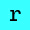 | 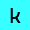 |  |  |  |  |  |  |
|---|---|---|---|---|---|---|---|---|---|
|  | 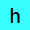 |  |  |  |  |  | 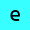 |  |  |   
|  | 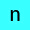 |  |  |  |  |  |  |  |  |  

<br>

imagemagick is massive, it's too big in fact but that doesn't mean we can't mess around with it and see what we can come up with, i'm interested in making small animated gifs of keyboard characters and that's exactly what i'm going to showcase here

<br>

## how to create an image using characters with imagemagick?
this couldn't be more easier, we'll use the program `convert` (in some version it's called magick) to achieve this
```
convert -gravity center -background yellow -fill black -size 30x30 caption:"A" A.jpg
```


as you can see `-gravity center` is supposed to center our character vertically and horizontally but it doesn't that correctly, we can correct this using `-trim` which remove white spcaes in the image and pad it to center with `-extent` and passing the same size as our output image
```
convert -gravity center -background yellow -fill black -size 30x30 caption:"A" -trim -extent 30x30 A.jpg
```


<br>

## output all of the characters in a for loop
now that we know how to output an image we'll use a for loop to convert all the numbers and alphabet characters in lower and higher case
```
for i in {a..z} {A..Z} {0..9} ; do convert -gravity center -trim -background yellow -fill black -font ./nerd.ttf -size 30x30 caption:$i -extent 30x30 $i.jpg ; done
```


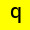


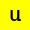


`{a..z} {A..Z} {0..9}` in our for loop tells our shell to iterate thru numbers 0 to 9, characters from a to z and A to Z one by one

we also used a custom font with `-font` called `nerd.ttf` which was actually `Caskaydia Cove Nerd Font Mono` which i renamed for simplicity and put inside the folder i'm making these images, you can also pass the abseloute path to it in your filesystem 

the mono in that font name refers to every character taking the same width as other, these fonts are typically used in ascii art, terminal emulators and code editors to easily be able to read them but i'm using the mono variant because it's easier to fit into the image

<br>

## printing special characters
special characters are harder to work with since they are not aload to be used in file names in windows specially so because we want to have a cross-platform solution we convert their file names to their hex counterparts, note that this command is a zsh exclusive command and doesn't work on bash
```
for char in {\!..\)} \@ \` {\*..\/} {\:..\?} {\[..\^} {\{..\~} ; do printf -v hex '%02X' $(( #char )) ; convert -gravity center -trim -background yellow -fill black -font ./nerd.ttf -size 30x30 -extent 30x30 caption:$char $hex.jpg ; done
```


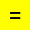


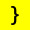


notice the segmented ranges in our for loop ``{\!..\)} \@ \` {\*..\/} {\:..\?} {\[..\^} {\{..\~}`` the reason for this is that we don't want duplicate characters as our normal characters above so we exclude the ranges they are in withing our for loop, if you don't care about file names you can do ``{" "..~}`` and combine both steps together

<br>

## animating the characters
so far we've been working with static image but let's change all of that and use ffmpeg to make a simple animating, we'll combine two for loops together one for the degrees of hue change (which changes the color of the images) and one for ffmpeg to iterate thru our images
```
for h in {30..360..30} ; for i in {a..z}.jpg {A..Z}.jpg {0..9}.jpg ; do mkdir output ; ffmpeg -i $i -vf hue=h=$h output/$h-$i ; done
```

we also made a `output` folder and put the output images inside it to keep things orginized, now cd into that folder ``cd output/``

we need to pad a zero before filenames because the shell doesn't read files numberically and doesn't know the number 30 in filenames comes before 120 for example
```
for x in *.jpg ; do mv $x `printf %03d-%s ${x%-*} ${x##*-}` ; done 
```

now we are ready to animate these image sequences using the `convert` program
```
for m in {a..z} {A..Z} {0..9} ; do convert *-$m.jpg $m.gif ; done 
```
notice that the same pattern that we used when converting the input images is used for outputing the animations


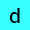


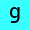


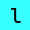


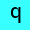


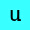


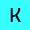


<br>

## animating special characters
the same principles applies here, we just need to adjust our commands a bit, first the ffmpeg command
```
for h in {30..360..30} ; for i in 21 22 23 24 25 26 27 28 29 2A 2B 2C 2D 2E 2F 3A 3B 3C 3D 3E 3F 40 5B 5C 5D 5E 60 7B 7C 7D 7E ; do mkdir output2 ; ffmpeg -i $i.jpg -vf hue=h=$h output2/$h-$i.jpg ; done
```
because we only want speciall characters and don't need duplicates we specially named every output file we need, we also made a new output2 folder to keep things orginized, cd into the folder like before ``cd output2/`` and zero pad them just like before ``for x in *.jpg ; do mv $x `printf %03d-%s ${x%-*} ${x##*-}` ; done``

now lets convert them to animated gifs
```
for m in 21 22 23 24 25 26 27 28 29 2A 2B 2C 2D 2E 2F 3A 3B 3C 3D 3E 3F 40 5B 5C 5D 5E 60 7B 7C 7D 7E ; do convert *-$m.jpg $m.gif ; done
```


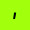
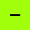
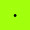


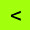
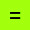


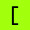

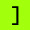

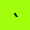
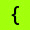

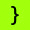


<br>

###### more examples coming soon
