|    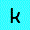 |     |  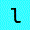   | 
|---|---|---|

<br>

imagemagick is massive, it's too big in fact but that doesn't mean we can't mess around with it and see what we can come up with, i'm interested in making small animated gifs of keyboard characters and that's exactly what i'm going to showcase here

note: there are a lot of little gifs need to be loaded for this page to look correctly, if you see any weird behavior of links not loading just refresh the page and your web browser hopefully caches everything by that time

this tutorial markdown was made possible partially by a helpful [comment on reddit](https://www.reddit.com/r/zsh/comments/r44ajo/need_help_converting_special_characters_in_file/) that fixed my problem printing speciall characters and helped giving usable names for them

<br>

### quick links
 * [output all characters](https://github.com/junguler/_dork-word-play#output-all-of-the-characters-in-a-for-loop)
 * [output special characters](https://github.com/junguler/_dork-word-play#printing-special-characters)
 * [animate the characters](https://github.com/junguler/_dork-word-play#animating-the-characters)
 * [animate the special characters](https://github.com/junguler/_dork-word-play#animating-special-characters)
 * [invert your gifs](https://github.com/junguler/_dork-word-play#invert-your-output-gifs)
 * [scroll your gifs](https://github.com/junguler/_dork-word-play#scroll-your-gifs)
 * [combine multiple filters](https://github.com/junguler/_dork-word-play#combine-multiple-filters)
 * [rotate your characters](https://github.com/junguler/_dork-word-play#rotate-your-characters)
 * [shades of grey as colors](https://github.com/junguler/_dork-word-play#using-shades-of-grey-as-color)
 * [merge multiple files together](https://github.com/junguler/_dork-word-play#merge-multiple-files-together)
 * [make a smooth gradient motion](https://github.com/junguler/_dork-word-play#making-a-smooth-gradient-animation-the-hard-way)
 * [variable sizes](https://github.com/junguler/_dork-word-play#variable-sizes)
 * [use multiple fonts](https://github.com/junguler/_dork-word-play#use-multiple-fonts)
 * [change character position](https://github.com/junguler/_dork-word-play#change-character-position)
 * [use glyphs/emojis](https://github.com/junguler/_dork-word-play#use-glyphsemojis)
 * [gotta print them all](https://github.com/junguler/_dork-word-play#gotta-print-them-all)
 * [generate random hex color values](https://github.com/junguler/_dork-word-play#generate-random-hex-colors-and-use-them)
 * [hex color values as text captions](https://github.com/junguler/_dork-word-play#hex-color-values-as-text-captions)
 * [add border to characters](https://github.com/junguler/_dork-word-play#add-border-to-characters)
 * [add stroke to characters](https://github.com/junguler/_dork-word-play#add-stroke-to-characters)

<br>

## how to create an image using characters with imagemagick?
this couldn't be more easier, we'll use the program `convert` (in the newest versions it's called magick so if you don't have the convert commandline program just change convert to magick in the commands) to achieve this
```
convert -gravity center -background yellow -fill black -size 30x30 caption:"A" A.jpg
```


as you can see `-gravity center` is supposed to center our character vertically and horizontally but it doesn't do that completely, we can correct this using `-trim` which removes white spaces in the image and pad it to center with `-extent` and passing the same size as our output image
```
convert -gravity center -background yellow -fill black -size 30x30 caption:"A" -trim -extent 30x30 A.jpg
```


<br>

## output all of the characters in a for loop
now that we know how to output an image we'll use a for loop to convert all the numbers and alphabet characters in lower and higher case
```
for i in {a..z} {A..Z} {0..9} ; do convert -gravity center -trim -background yellow -fill black -font ./nerd.ttf -size 30x30 caption:$i -extent 30x30 $i.jpg ; done
```


`{a..z} {A..Z} {0..9}` in our for loop tells our shell to iterate thru numbers 0 to 9, characters from a to z and A to Z one by one

we also used a custom font with `-font` called `nerd.ttf` which was actually `Caskaydia Cove Nerd Font Mono` which i renamed for simplicity and put inside the folder i'm making these images, you can also pass the absolute path to it in your filesystem 

the mono in that font name refers to every character taking the same width as other, these fonts are typically used in ascii art, terminal emulators and code editors to easily be able to read them but i'm using the mono variant because it's easier to fit into the image

<br>

## printing special characters
special characters are harder to work with since they are not aloud to be used in file names in windows specially so because we want to have a cross-platform solution we convert their file names to their hex counterparts, note that this command is a zsh exclusive command and doesn't work on bash
```
for char in {\!..\)} \@ \` {\*..\/} {\:..\?} {\[..\^} {\{..\~} ; do printf -v hex '%02X' $(( #char )) ; convert -gravity center -trim -background yellow -fill black -font ./nerd.ttf -size 30x30 -extent 30x30 caption:$char $hex.jpg ; done
```


notice the segmented ranges in our for loop ``{\!..\)} \@ \` {\*..\/} {\:..\?} {\[..\^} {\{..\~}`` the reason for this is that we don't want duplicate characters as our normal characters above so we exclude the ranges they are in within our for loop, if you don't care about file names you can do ``{\!..~}`` and combine both steps together

<br>

## animating the characters

so far we've been working with static image but let's change all of that and use ffmpeg to make a simple animation, we'll combine two for loops together one for the degrees of hue change (which changes the color of the images) and one for ffmpeg to iterate thru our images
```
for h in {30..360..30} ; for i in {a..z}.jpg {A..Z}.jpg {0..9}.jpg ; do mkdir output ; ffmpeg -i $i -vf hue=h=$h output/$h-$i ; done
```

we also made a `output` folder and put the output images inside it to keep things organized, now cd into that folder ``cd output/``

now we are ready to animate these image sequences using the `convert` program
```
for m in {a..z} {A..Z} {0..9} ; do convert $(ls -v *-$m.jpg) $m.gif ; done 
```
notice that the same pattern that we used when converting the input images is used for outputting the animations, we also used `ls -v` here to sort filenames numerically, if you don't do this the shell doesn't really sort filenames correctly and only sort by the first digit number, for example 20.jpg is placed earlier than 3.jpg


<br>

## animating special characters
the same principles applies here, we just need to adjust our commands a bit, first the ffmpeg command
```
for h in {30..360..30} ; for i in 21 22 23 24 25 26 27 28 29 2A 2B 2C 2D 2E 2F 3A 3B 3C 3D 3E 3F 40 5B 5C 5D 5E 60 7B 7C 7D 7E ; do mkdir output2 ; ffmpeg -i $i.jpg -vf hue=h=$h output2/$h-$i.jpg ; done
```
because we only want specially characters and don't need duplicates we specially named every output file we need, we also made a new output2 folder to keep things organized, cd into the folder like before, now lets convert them to animated gifs
```
for m in 21 22 23 24 25 26 27 28 29 2A 2B 2C 2D 2E 2F 3A 3B 3C 3D 3E 3F 40 5B 5C 5D 5E 60 7B 7C 7D 7E ; do convert $(ls -v *-$m.jpg) $m.gif ; done
```


<br>

## invert your output gifs
the easiest way to modify our newly made gifs is to invert them, it really changes the look of everything and it's so simple to do

```
for i in *.gif ; do mkdir inverted ; ffmpeg -i $i -vf negate inverted/I-$i ; done
```


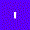


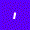
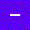
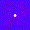

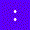
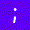

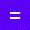


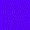


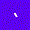


<br>

## scroll your gifs

using ffmpeg scroll filter, we can scroll our gifs horizontally or vertically

```
for i in *.gif ; do mkdir h-scroll ; ffmpeg -i $i -vf scroll=h=0.09 h-scroll/H-$i ; done
```


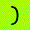


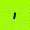
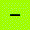
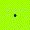

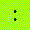
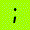


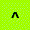
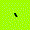
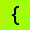

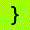


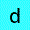


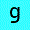

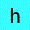


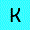


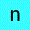


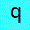


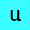


```
for i in *.gif ; do mkdir v-scroll ; ffmpeg -i $i -vf scroll=v=-0.09 v-scroll/V-$i ; done
```


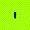


if you want to reverse the motion either add a negative sign `-` before the values like in our vertical example or do not include it like the horizontal example

<br>

## combine multiple filters
say i don't care about the colors of above animations but i do like motion so let's make it black & white we also use `,` to combine this filter with invert to make a dark variant of those animations

```
for i in *.gif ; do mkdir bw-inv ; ffmpeg -i $i -vf hue=s=0,negate bw-inv/B-$i ; done
```


the same results can be achieved with the convert's own `-negate` for the invert and `-monochrome` for black and white filter but since we already had our gifs made i used ffmpeg because it has more options and filters to play with 

<br>

## rotate your characters
convert has a native flag for rotating images and in our case characters so let's use it to create these images and iterate thru them all with rotation

```
for h in {30..360..30} ; for i in {a..z} {A..Z} {0..9} ; do convert -gravity center -trim -background blue -fill cyan -font ./nerd.ttf -size 30x30 caption:$i -rotate $h -extent 30x30 $h-$i.jpg ; done
```

and for special characters

```
for h in {30..360..30} ; for char in {\!..\)} \@ \` {\*..\/} {\:..\?} {\[..\^} {\{..\~} ; do printf -v hex '%02X' $(( #char )) ; convert -gravity center -trim -background blue -fill cyan -rotate $h -font ./nerd.ttf -size 30x30 -extent 30x30 caption:$char $h-$hex.jpg ; done
```

for turning everything counter-clock wise just add a negative sign `-` before `$h` like this `-rotate -$h` in both commands to achieve this, lets get to converting these

```
for m in {a..z} {A..Z} {0..9} ; do convert $(ls -v *-$m.jpg) RR-$m.gif ; done
```

and for special characters

```
for m in 21 22 23 24 25 26 27 28 29 2A 2B 2C 2D 2E 2F 3A 3B 3C 3D 3E 3F 40 5B 5C 5D 5E 60 7B 7C 7D 7E ; do convert $(ls -v *-$m.jpg) RR-$m.gif ; done
```

same two commands can be run on your counter-clock rotation image sequences


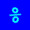

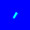


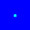


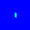


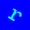


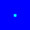

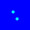


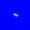


<br>

## using shades of grey as color
imagemagick uses a wide variety of color values and names as input, look [here](https://imagemagick.org/script/color.php) for a complete explanation, but the easiest way to use this is by choosing color names, for the shades of grey specifically there are grey0 which is a black color to grey100 which is a white color and everything between grey1 and grey99 are shades of grey, knowing this we can easily loop thru them in a for loop like this 
```
for i in {0..9} {a..z} {A..Z} ; for g in {0..100..10} ; do convert -gravity center -trim -background grey50 -fill grey$g -font ./nerd.ttf -size 30x30 caption:$i -extent 30x30 $g-$i.jpg ; done
```
as you can see we just need to loop thru the numbers and append them to the grey word in the -fill flag `-fill grey$g` we also only use every 10th number in the loop for a total of 10 frames, the background color stays the same as a neutral grey50, now for converting
```
for m in {a..z} {A..Z} {0..9} ; do convert $(ls -v *-$m.jpg) $m.gif ; done
```
for special characters do 
```
for char in {\!..\)} \@ \` {\*..\/} {\:..\?} {\[..\^} {\{..\~} ; for g in {0..100..10} ; do printf -v hex '%02X' $(( #char )) ; convert -gravity center -trim -background grey50 -fill grey$g -font ./nerd.ttf -size 30x30 -extent 30x30 caption:$char $g-$hex.jpg ; done
```
```
for m in 21 22 23 24 25 26 27 28 29 2A 2B 2C 2D 2E 2F 3A 3B 3C 3D 3E 3F 40 5B 5C 5D 5E 60 7B 7C 7D 7E ; do convert $(ls -v *-$m.jpg) g-$m.gif ; done
```


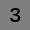


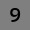


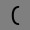
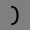


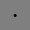


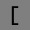

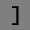

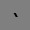
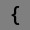

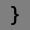

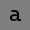


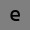


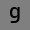


<br>

## merge multiple files together
using `-adjoin` we can easily combine multiple images to make a gif file
```
convert -adjoin $(ls -v *.jpg) all.gif
```


if you want to change the framerate of these gifs we can use the `-delay` flag, by default convert has a 100 ticks (same as milliseconds) per seconds, any amount of delay we add gets divided by this number and applied before each image in our sequence of images, so the number 8 results in 12.5 frames per second, 16 results in 6.25 fps and so on
```
convert -adjoin -delay 16 $(ls -v *.jpg) all+.gif
```


combining multiple gifs together can be done using the same joining method
```
convert -adjoin $(ls -v *.gif) numbers.gif
```


<br>

## making a smooth gradient animation, the hard way
in one of the above sections i showed how to use ffmpeg's hue filter to make a gradient with colors, it gets the job done but sometimes you want more control with exact colors you want to use

imagemagick gives many options for specifying colors, in our case we'll use `rgb(100%, 0%, 0%)` which takes percentages as RGB values, lets start by changing the colors from red `rgb(100%, 0%, 0%)` to magenta `rgb(100%, 0%, 100%)` with 10% increments
```
for i in {a..z} {A..Z} {0..9} ; for g in {0..100..10} ; do convert -gravity center -trim -background "rgb(100%,0%,$g%)" -fill white -font ./nerd.ttf -size 30x30 caption:$i -extent 30x30 A-$g-$i.jpg ; done
```
```
for char in {\!..\)} \@ \` {\*..\/} {\:..\?} {\[..\^} {\{..\~} ; for g in {0..100..10} ; do printf -v hex '%02X' $(( #char )) ; convert -gravity center -trim -background "rgb(100%,0%,$g%)" -fill white -font ./nerd.ttf -size 30x30 -extent 30x30 caption:$char A-$g-$hex.jpg ; done
```

<br>

now, make a loop that changes magenta `rgb(100%, 0%, 100%)` to blue `rgb(0%, 0%, 100%)`
```
for i in {a..z} {A..Z} {0..9} ; for g in {100..0..10} ; do convert -gravity center -trim -background "rgb($g%,0%,100%)" -fill white -font ./nerd.ttf -size 30x30 caption:$i -extent 30x30 B-$g-$i.jpg ; done
```
```
for char in {\!..\)} \@ \` {\*..\/} {\:..\?} {\[..\^} {\{..\~} ; for g in {0..100..10} ; do printf -v hex '%02X' $(( #char )) ; convert -gravity center -trim -background "rgb($g%,0%,100%)" -fill white -font ./nerd.ttf -size 30x30 -extent 30x30 caption:$char B-$g-$hex.jpg ; done
```

<br>

now convert your first batch of images to gifs
```
for m in {a..z} {A..Z} {0..9} ; do convert $(ls -v A-*-$m.jpg) A1-$m.gif ; done
```
```
for m in 21 22 23 24 25 26 27 28 29 2A 2B 2C 2D 2E 2F 3A 3B 3C 3D 3E 3F 40 5B 5C 5D 5E 60 7B 7C 7D 7E ; do convert $(ls -v A-*-$m.jpg) A1-$m.gif ; done   
```


<br>

convert the second batch of images to gifs
```
for m in {a..z} {A..Z} {0..9} ; do convert $(ls -vr B-*-$m.jpg) A2-$m.gif ; done
```
```
for m in 21 22 23 24 25 26 27 28 29 2A 2B 2C 2D 2E 2F 3A 3B 3C 3D 3E 3F 40 5B 5C 5D 5E 60 7B 7C 7D 7E ; do convert $(ls -vr B-*-$m.jpg) A2-$m.gif ; done  
```

note that we use the `-r` flag with ls to sort and feed images in reverse for the second batch of gifs


<br>

combine both sets of gifs together
```
for m in {a..z} {A..Z} {0..9} ; do convert -adjoin A1-$m.gif A2-$m.gif A3-$m.gif ; done
```
```
for m in 21 22 23 24 25 26 27 28 29 2A 2B 2C 2D 2E 2F 3A 3B 3C 3D 3E 3F 40 5B 5C 5D 5E 60 7B 7C 7D 7E ; do convert -adjoin A1-$m.gif A2-$m.gif A3-$m.gif ; done
```


<br>

now make a reversed duplicated sets of these gifs to have a smooth back and forth motion in the last step
```
for m in {a..z} {A..Z} {0..9} ; do convert -reverse A3-$m.gif A4-$m.gif ; done
```
```
for m in 21 22 23 24 25 26 27 28 29 2A 2B 2C 2D 2E 2F 3A 3B 3C 3D 3E 3F 40 5B 5C 5D 5E 60 7B 7C 7D 7E ; do convert -reverse A3-$m.gif A4-$m.gif ; done
```


<br>

finally combine your 3rd and 4th batches of gifs to get the final result
```
for m in {a..z} {A..Z} {0..9} ; do convert -adjoin A3-$m.gif A4-$m.gif A5-$m.gif ; done
```
```
for m in 21 22 23 24 25 26 27 28 29 2A 2B 2C 2D 2E 2F 3A 3B 3C 3D 3E 3F 40 5B 5C 5D 5E 60 7B 7C 7D 7E ; do convert -adjoin A3-$m.gif A4-$m.gif A5-$m.gif ; done
```


<br>

for the bonus round, lets invert these gifs using convert's own `-negate` and make it like these are completely new gifs
```
for m in {a..z} {A..Z} {0..9} ; do convert -negate A5-$m.gif A6-$m.gif ; done
```
```
for m in 21 22 23 24 25 26 27 28 29 2A 2B 2C 2D 2E 2F 3A 3B 3C 3D 3E 3F 40 5B 5C 5D 5E 60 7B 7C 7D 7E ; do convert -negate A5-$m.gif A6-$m.gif ; done
```


<br>

## variable sizes
using `-pointsize` flag we can set the size of our characters in our for loop
```
for i in {a..z} {A..Z} {0..9} ; for s in {5..50..5} ; do convert -gravity center -trim -background grey25 -fill grey75 -font ./nerd.ttf -size 30x30 -pointsize $s caption:$i -extent 30x30 $i-$s.jpg ; done
```
```
for char in {\!..\)} \@ \` {\*..\/} {\:..\?} {\[..\^} {\{..\~} ; for s in {5..50..5} ; do printf -v hex '%02X' $(( #char )) ; convert -gravity center -trim -background grey25 -fill grey75 -font ./nerd.ttf -size 30x30 -extent 30x30 -pointsize $s caption:$char $hex-$s.jpg ; done
```
now for converting them
```
for m in {a..z} {A..Z} {0..9} ; do convert -delay 8 $(ls -v $m-*.jpg) S-$m.gif ; done
```
```
for m in 21 22 23 24 25 26 27 28 29 2A 2B 2C 2D 2E 2F 3A 3B 3C 3D 3E 3F 40 5B 5C 5D 5E 60 7B 7C 7D 7E ; do convert -delay 8 $(ls -v $m-*.jpg) S-$m.gif ; done 
```


reversing this motion is easy
```
for m in {a..z} {A..Z} {0..9} ; do convert -reverse S-$m.gif R-$m.gif ; done
```
```
for m in 21 22 23 24 25 26 27 28 29 2A 2B 2C 2D 2E 2F 3A 3B 3C 3D 3E 3F 40 5B 5C 5D 5E 60 7B 7C 7D 7E ; do convert -reverse S-$m.gif R-$m.gif ; done
```


<br>

## use multiple fonts
we can use multiple fonts in our for loop, i've included a few nerd fonts in the font folder of this repo, for the simplicity and ease of use the names have been removed for this following command and i only use the two digit numbers at the beginning
```
for i in {a..z} {A..Z} {0..9} ; for f in *.ttf ; do convert -gravity center -trim -background grey75 -fill grey25 -font ./$f -size 30x30 caption:$i -extent 30x30 $i-$f.jpg ; done
```
```
for char in {\!..\)} \@ \` {\*..\/} {\:..\?} {\[..\^} {\{..\~} ; for f in *.ttf ; do printf -v hex '%02X' $(( #char )) ; convert -gravity center -trim -background grey75 -fill grey25 -font ./$f -size 30x30 -extent 30x30 caption:$char $hex-$f.jpg ; done
```
convert the image sequences, using a longer delay of 16
```
for m in {a..z} {A..Z} {0..9} ; do convert -delay 16 $(ls -v $m-*.jpg) F-$m.gif ; done
```
```
for m in 21 22 23 24 25 26 27 28 29 2A 2B 2C 2D 2E 2F 3A 3B 3C 3D 3E 3F 40 5B 5C 5D 5E 60 7B 7C 7D 7E ; do convert -delay 16 $(ls -v $m-*.jpg) F-$m.gif ; done
```


<br>

## change character position
with every example so far we've been trying to keep the character at the center of the image using `-gravity center` but we can change the position and make a motion out of it, the -gravity flags takes 9 alignment positions using center, north, northeast and etc, so lets loop all of the 9 positions in a for loop
```
for i in {a..z} {A..Z} {0..9} ; for g in northwest north northeast west center east southwest south southeast ; do convert -gravity $g -trim -background green -fill yellow -font ./nerd.ttf -size 30x30 caption:$i -extent 30x30 $i-$g.jpg ; done
```
```
for char in {\!..\)} \@ \` {\*..\/} {\:..\?} {\[..\^} {\{..\~} ; for g in northwest north northeast west center east southwest south southeast ; do printf -v hex '%02X' $(( #char )) ; convert -gravity $g -trim -background green -fill yellow -font ./nerd.ttf -size 30x30 -extent 30x30 caption:$char $hex-$g.jpg ; done
```
these two commands give us the character and the position they are after as filenames

| northwest | north | northeast |
|---|---|---|
|  |  |  |
| west | center | east |
|  |  |  |
| southwest | south | southeast |
|  |  |  |

now we need to decide the direction of our motion and change these filenames accordingly, i want a normal clockwise motion from northwest to west so we'll rename these files one by one and pad the next number after them, here is the first example which changes every filename that has northwest in it to 1 which is the first frame in each of our gifs
```
for i in *-northwest.jpg ; do mv "$i" "${i/northwest/1}" ; done
```
same command can be used for the next positions, or better yet, do it all in one giant command!
```
for i in *-northwest.jpg ; do mv "$i" "${i/northwest/1}" ; done 
for i in *-north.jpg ; do mv "$i" "${i/north/2}" ; done
for i in *-northeast.jpg ; do mv "$i" "${i/northeast/3}" ; done
for i in *-east.jpg ; do mv "$i" "${i/east/4}" ; done
for i in *-southeast.jpg ; do mv "$i" "${i/southeast/5}" ; done
for i in *-south.jpg ; do mv "$i" "${i/south/6}" ; done
for i in *-southwest.jpg ; do mv "$i" "${i/southwest/7}" ; done
for i in *-west.jpg ; do mv "$i" "${i/west/8}" ; done
```
we take the opportunity to remove the unwanted center pictures since we don't need them anymore, depending on the motion you desire you might want to keep these or remove even more of these positions or don't even include them in your for loops
```
rm *-center.jpg
```
now convert these images to gifs
```
for m in {a..z} {A..Z} {0..9} ; do convert $(ls -v $m-*.jpg) ge-$m.gif ; done 
```
```
for m in 21 22 23 24 25 26 27 28 29 2A 2B 2C 2D 2E 2F 3A 3B 3C 3D 3E 3F 40 5B 5C 5D 5E 60 7B 7C 7D 7E ; do convert $(ls -v $m-*.jpg) ge-$m.gif ; done
```


<br>

## use glyphs/emojis
in a few of the examples above i've mentioned using one of a [nerd fonts](https://www.nerdfonts.com/#home) which are a collection of 50+ free and open source fonts that are patched with 3600+ icons, using them is quite easy, just check their [cheat sheet](https://www.nerdfonts.com/cheat-sheet) and search for the string you like, when you found a glyph you like hover over it and click on the icon name to copy the glyph to your clipboard


now that we have a few of the icons we like, we can print them using convert
```
for i in  ﱘ      ; do convert -gravity center -trim -background grey25 -fill orange -font ./nerd.ttf -size 40x40 caption:$i -extent 30x30 $i.jpg ; done 
```
don't worry if your terminal emulator or web browser is not capable of showing these icons, our font is patched with them and imagemagick is going to print them just fine, notice that we set `-size` to `40x40` but used `-extent 30x30` to make the pictures smaller, this is because these glyphs have some white space around them and because we are working with such small pixel sizes we want to take advantage of the small screen realstate as much as possible

these filenames look kind of weird on your filesystem, so lets change them to be able to use them without any issues
```
A=1 ; for i in *.jpg ; do mv $i glyph-$[A].jpg ; A=$(( $A + 1 )) ; done
```


how about some arrows


lock and key


if for whatever reason you are not able to use a glyph icon directly inside your terminal you can also use the hex value of a glyph like this, just add `\u` before the actual 4 digit hex glyph to let the shell know what it is
```
for i in $(echo -e '\ufc58') ; do convert -gravity center -trim -background grey25 -fill orange -font ./nerd.ttf -size 40x40 caption:$i -extent 30x30 $i.jpg ; done
```
this echo command inside our for loop acts exactly as if we supplied the glyph itself

printing multiple hex glyps is also easy, just include them inside our echo command and separate each with quotes
```
for i in $(echo -e '\ufc58' '\uf832' '\ufc59') ; do convert -gravity center -trim -background grey25 -fill orange -font ./nerd.ttf -size 40x40 caption:$i -extent 30x30 $i.jpg ; done
```

<br>

## gotta print them all!
what if i want to print every nerd font glyphs in one command? well, we can do that no problem, i've scraped all of the hex values of these glyphs from this [css file](https://github.com/ryanoasis/nerd-fonts/blob/master/css/nerd-fonts-generated.css) provided by the nerd-fonts repo and included them in the root folder of this repo [here](https://github.com/junguler/_dork-word-play/blob/main/nerd-glyphs.txt), now we just need to echo them one by one and feed them to imagemagick
```
for i in $(echo -e $(cat nerd-glyphs.txt)) ; do convert -gravity center -trim -background grey25 -fill orange -font ./nerd.ttf -size 90x90 caption:$i -extent 80x80 $i.jpg ; done
```
if you are on linux you should be ok with glyphs as filenames and it will make them very easy to find but for cross platform compatibility lets rename these files with the command i've showed above
```
A=1 ; for i in *.jpg ; do mv $i glyph-$[A].jpg ; A=$(( $A + 1 )) ; done
```
because there is so many images (3689) i'm not going to link them here but i'll include them as a [zip file](https://github.com/junguler/_dork-word-play/blob/main/nerd-glyphs.zip) in the root directory of this repo

<br>

## generate random hex colors and use them
making a list of random colors is easy, i just did a quick search and found [this page](https://www.unix.com/shell-programming-and-scripting/268487-awk-unix-random-rgb-colors-generator.html) that has the answer, it does work but we want a list of 100 hex colors so we want to use it in a for loop
```
for i in {1..100} ; do printf "%02x%02x%02x\n" $((RANDOM%256)) $((RANDOM%256)) $((RANDOM%256)) >> colors.txt ; done
```
this command saves 100 randomized color values to the `colors.txt` text file, notice the use of `>>` if we only used `>` the text file would have be overwritten each time and would only contain one hex value, now lets use these newly made hex values as background colors for our images
```
for i in $(cat colors.txt) ; do convert -gravity center -trim -background \#$i -fill black -font ./nerd.ttf -size 30x30 caption:A -extent 30x30 $i.jpg ; done
```
the backslash `\` is used to escape the hashtag `#` sign which normally comments out everything after it but we want to use it to tell imagemagick we are going to use a hex color value as background color


the same colors can be used as the color of our characters, it looks very different with a simple background color inversion
```
for i in $(cat colors.txt) ; do convert -gravity center -trim -background white -fill \#$i -font ./nerd.ttf -size 30x30 caption:A -extent 30x30 $i.jpg ; done
```


<br>

## hex color values as text captions
using the same command as above, create the list of 100 random hex colors, now use these hex values as the caption of the image too, because the string is longer lets make the images 90x30 pixels 
```
for i in $(cat colors.txt) ; do convert -gravity center -trim -background \#$i -fill black -font ./nerd.ttf -size 90x30 caption:\#$i -extent 90x30 $i.jpg ; done
```


<br>

## add border to characters
adding border is easy, specify it's width with `-border` and it's color with `-bordercolor` this normally applies to the frame of the image but since we are apply trim to these characters to make them center to border starts to wrap around the character
```
for i in {a..z} {A..Z} {0..9} ; for s in {1..10..2} ; do convert -gravity center -trim -background yellow -fill black -border $s -bordercolor orange -font ./nerd.ttf -size 30x30 caption:$i -extent 30x30 $i-$s.jpg ; done
```
```
for char in {\!..\)} \@ \` {\*..\/} {\:..\?} {\[..\^} {\{..\~} ;  for s in {1..10..2}  ; do printf -v hex '%02X' $(( #char )) ; convert -gravity center -trim -background yellow -fill black -border $s -bordercolor orange -font ./nerd.ttf -size 30x30 -extent 30x30 caption:$char $hex-$s.jpg ; done
```
now convert the images to gifs
```
for m in {a..z} {A..Z} {0..9} ; do convert $(ls -v $m*.jpg) B-$m.gif ; done
```
```
for m in 21 22 23 24 25 26 27 28 29 2A 2B 2C 2D 2E 2F 3A 3B 3C 3D 3E 3F 40 5B 5C 5D 5E 60 7B 7C 7D 7E ; do convert $(ls -v $m*.jpg) B-$m.gif ; done
```
reverse the frames in these gifs
```
for m in {a..z} {A..Z} {0..9} ; do convert -reverse B-$m.gif C-$m.gif ; done
```
```
for m in 21 22 23 24 25 26 27 28 29 2A 2B 2C 2D 2E 2F 3A 3B 3C 3D 3E 3F 40 5B 5C 5D 5E 60 7B 7C 7D 7E ; do convert -reverse B-$m.gif C-$m.gif ; done  
```
now combine both sets of gifs
```
for m in {a..z} {A..Z} {0..9} ; do convert -adjoin B-$m.gif C-$m.gif D-$m.gif ; done
```
```
for m in 21 22 23 24 25 26 27 28 29 2A 2B 2C 2D 2E 2F 3A 3B 3C 3D 3E 3F 40 5B 5C 5D 5E 60 7B 7C 7D 7E ; do convert -adjoin B-$m.gif C-$m.gif D-$m.gif ; done
```


and the inverted variants
```
for m in {a..z} {A..Z} {0..9} ; do convert -negate D-$m.gif E-$m.gif ; done
```
```
for m in 21 22 23 24 25 26 27 28 29 2A 2B 2C 2D 2E 2F 3A 3B 3C 3D 3E 3F 40 5B 5C 5D 5E 60 7B 7C 7D 7E ; do convert -negate D-$m.gif E-$m.gif ; done
```


<br>

## add stroke to characters
stroke is not additive to the overal size of our characters but it devours them, we can work with and make a cool effect using `-stroke` for color and `-strokewidth` for it's width, this flag also takes negative numbers so making a back and forth motion is easy to do with one command
```
for i in {a..z} {A..Z} {0..9} ; for s in {3..-3} ; do convert -gravity center -trim -background grey50 -fill yellow -strokewidth $s -stroke orange -font ./nerd.ttf -size 30x30 caption:$i -extent 30x30 $i-$s.jpg ; done
```
```
for char in {\!..\)} \@ \` {\*..\/} {\:..\?} {\[..\^} {\{..\~} ; for s in {3..-3} ; do printf -v hex '%02X' $(( #char )) ; convert -gravity center -trim -background grey50 -fill yellow -strokewidth $s -stroke orange -font ./nerd.ttf -size 30x30 -extent 30x30 caption:$char $hex-$s.jpg ; done
```
convert them
```
for m in {a..z} {A..Z} {0..9} ; do convert $(ls -v $m*.jpg) ST-$m.gif ; done 
```
```
for m in 21 22 23 24 25 26 27 28 29 2A 2B 2C 2D 2E 2F 3A 3B 3C 3D 3E 3F 40 5B 5C 5D 5E 60 7B 7C 7D 7E ; do convert $(ls -v $m*.jpg) ST-$m.gif ; done
```


